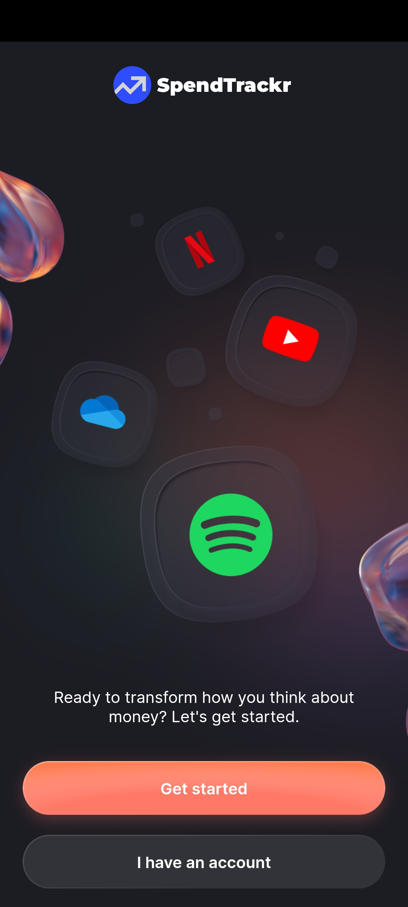
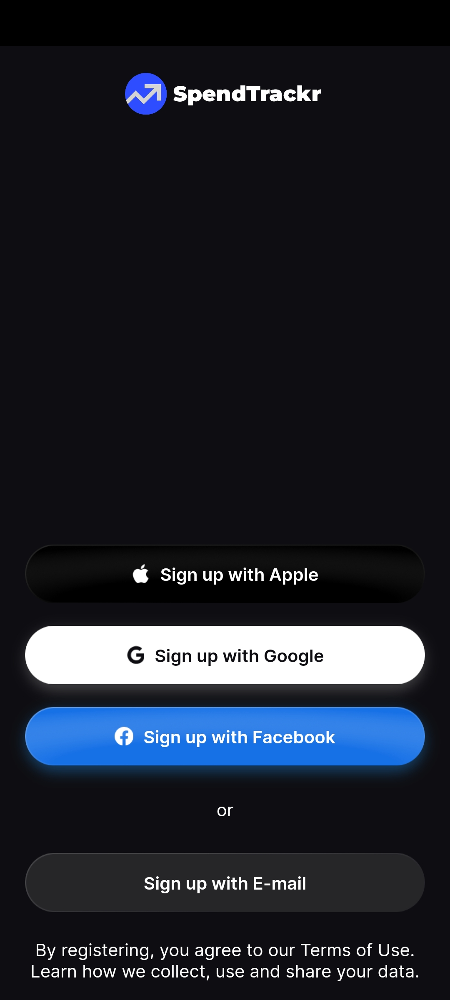
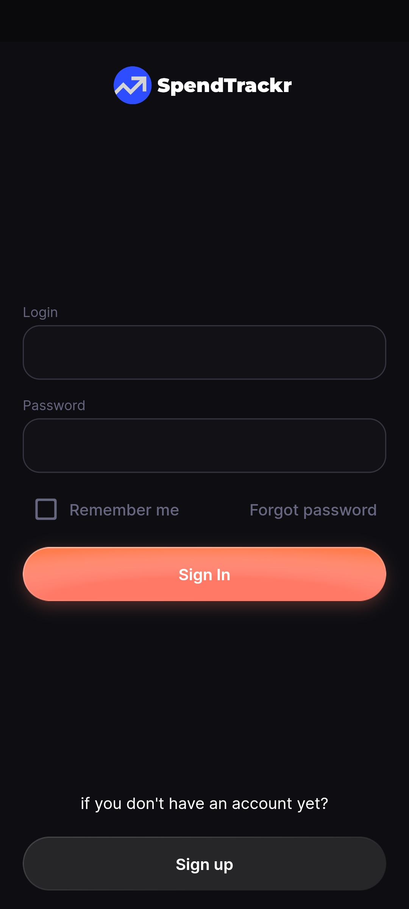
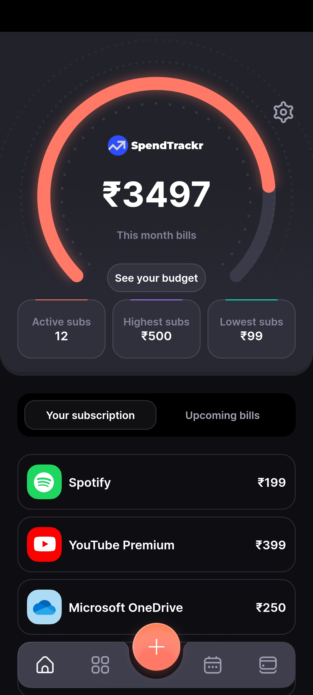
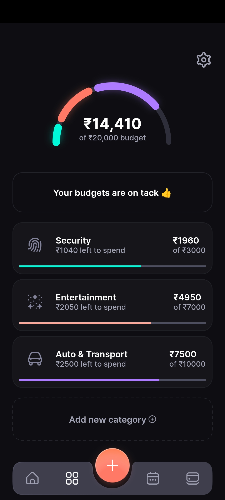
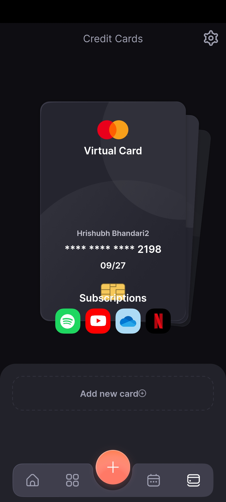
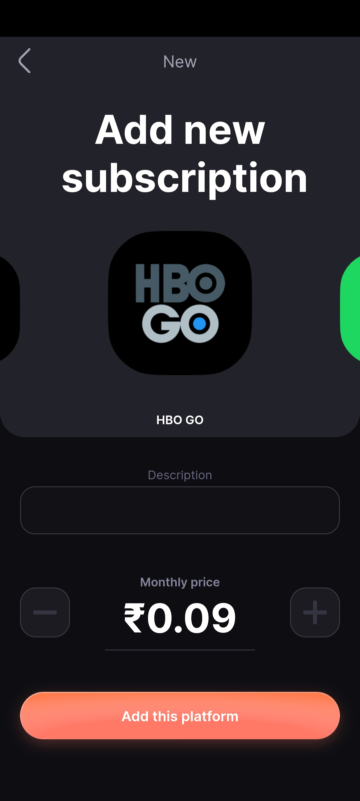
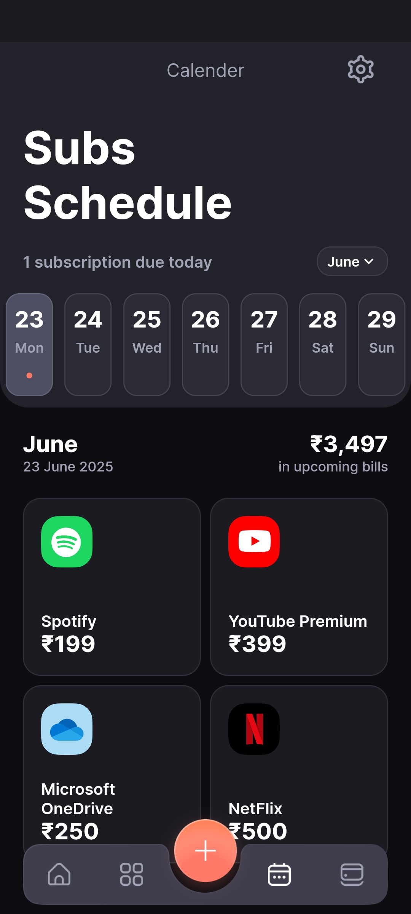
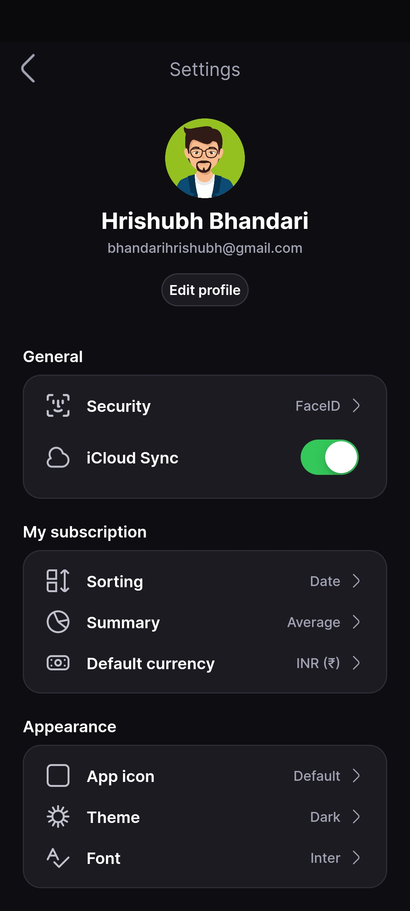

# 💸 SpendTrackr: Monthly Expenses Tracker

> **A beautifully designed Flutter app with Firebase integration to track, analyze, and manage your monthly expenses, subscriptions, and budgets in real-time.**


## 📋 Table of Contents

- [Overview](#-overview)
- [Screenshots](#-screenshots)
- [Key Features](#-key-features)
- [Technology Stack](#-technology-stack)
- [Firebase Integration](#-firebase-integration)
- [Installation](#-installation)
- [Firebase Setup](#-firebase-setup)
- [Usage](#-usage)
- [Contributing](#-contributing)
- [License](#-license)

---

## 🎯 Overview

**SpendTrackr** is a cross-platform mobile app built with Flutter, designed to help users effortlessly track their monthly expenses, manage subscriptions, and set spending budgets. With a clean UI, insightful analytics, and robust features, SpendTrackr empowers users to take control of their finances.

### What Makes SpendTrackr Special

- **All-in-One Finance Management**: Track expenses, manage recurring subscriptions, and set monthly budgets in one place.
- **Beautiful UI/UX**: Modern, intuitive, and responsive design for a delightful user experience.
- **Insightful Analytics**: Visualize spending patterns with charts and summaries.
- **Cross-Platform**: Runs seamlessly on both Android and iOS devices.

---

## 🖼 Screenshots

Below are screenshots demonstrating the main features and UI of SpendTrackr:

### Cover Screen
<div align="center">
  
  <br/>
  <em>Cover Screen of the application.</em>
</div>

---

### Login Screens
<div align="center">
  
  
  
  <br/>
  <em>Login Pages of the application with options to login with Google, Apple (soon) & Facebok (soon).</em>
</div>

---

### Dashboard
<div align="center">
  
  <br/>
  <em>Comprehensive overview of your monthly spending, budgets, and quick actions.</em>
</div>

---

### My Budget
<div align="center">
  
  <br/>
  <em>Track your budgets and monitor your spending progress by category.</em>
</div>

---

### Card Details
<div align="center">
  
  <br/>
  <em>View detailed information about your cards and transactions.</em>
</div>

---

### Add Subscription
<div align="center">
  
  <br/>
  <em>Easily add and manage recurring subscriptions.</em>
</div>

---

### Subscription Schedule
<div align="center">
  
  <br/>
  <em>See upcoming subscription payments and their schedules.</em>
</div>

---

### Settings
<div align="center">
  
  <br/>
  <em>Customize your app experience and manage preferences.</em>
</div>

---

## ✨ Key Features

### 📊 **Expense Tracking**
- Add, edit, and delete expenses with categories and notes
- View monthly, weekly, and daily breakdowns
- Filter and sort transactions

### 🔔 **Subscription Management**
- Track recurring subscriptions (Netflix, Spotify, etc.)
- Get reminders for upcoming bills
- Visualize total monthly subscription costs

### 💰 **Budgeting**
- Set monthly spending limits by category
- Monitor progress and receive alerts when nearing limits

### 📅 **Calendar Integration**
- Calendar view for all expenses and bills
- Agenda-style overview of upcoming payments

### 📈 **Analytics & Insights**
- Pie and bar charts for spending analysis
- Category-wise breakdowns
- Trends and historical data

### 🛡️ **Secure & Private**
- Firebase Authentication for secure user accounts
- User-specific data isolation in Firestore
- Real-time data synchronization across devices

### 🔄 **Real-time Updates**
- Live subscription tracking
- Instant budget updates
- Real-time bill notifications

---

## 🛠 Technology Stack

### **Frontend**
- **Flutter 3.19.6** - Cross-platform UI toolkit
- **Dart 3.4.3** - Programming language
- **Provider** - State management
- **Custom Widgets** - Reusable UI components

### **Backend & Database**
- **Firebase Authentication** - User authentication
- **Cloud Firestore** - NoSQL database
- **Firebase Storage** - File storage (future)

### **Additional Libraries**
- **UUID** - Unique ID generation
- **Intl** - Internationalization
- **Custom Calendar** - Calendar agenda widget
- **Card Swiper** - Interactive card carousel

---

## 🔥 Firebase Integration

SpendTrackr uses Firebase for a complete backend solution:

### **Authentication**
- Email/Password sign up and sign in
- Password reset functionality
- Secure user session management
- User profile management

### **Database Structure**
```
📁 users/
├── User profiles and settings

📁 subscriptions/
├── Netflix, Spotify, YouTube Premium, etc.
├── Billing cycles and amounts
└── Next billing dates

📁 budgets/
├── Monthly budget categories
├── Spent amount tracking
└── Budget periods

📁 transactions/
├── Income and expense records
├── Linked to subscriptions/budgets
└── Payment methods

📁 cards/
├── Credit/debit card information
├── Balances and limits
└── Secure storage (last 4 digits only)
```

### **Real-time Features**
- Live subscription updates
- Instant budget tracking
- Real-time bill notifications
- Cross-device synchronization

---

## 🚀 Installation

### Prerequisites

- [Flutter SDK](https://flutter.dev/docs/get-started/install) (3.19.6 or compatible)
- [Firebase CLI](https://firebase.google.com/docs/cli) (for Firebase setup)
- Android Studio or Xcode (for emulators/simulators)
- A device or emulator

### Quick Start

1. **Clone the repository**
   ```bash
   git clone https://github.com/your-username/SpendTrackr_Monthly_Expenses_Tracker.git
   cd SpendTrackr_Monthly_Expenses_Tracker
   ```

2. **Install dependencies**
   ```bash
   flutter pub get
   ```

3. **Set up Firebase** (see [Firebase Setup](#-firebase-setup) section below)

4. **Run the app**
   ```bash
   flutter run
   ```

---

## 🔥 Firebase Setup

### Step 1: Create Firebase Project

1. Go to [Firebase Console](https://console.firebase.google.com/)
2. Create a new project: `spendtrackr-app`
3. Enable Google Analytics (optional)

### Step 2: Enable Services

1. **Authentication**: Enable Email/Password sign-in
2. **Firestore**: Create database in test mode
3. **Storage**: Enable for future file uploads

### Step 3: Add Your App

1. Add Android app with package name: `com.example.spendtrackr`
2. Download `google-services.json` → place in `android/app/`
3. Add iOS app with bundle ID: `com.example.spendtrackr`
4. Download `GoogleService-Info.plist` → place in `ios/Runner/`

### Step 4: Configure Firebase Options

Update `lib/firebase_options.dart` with your project config:

```dart
static const FirebaseOptions android = FirebaseOptions(
  apiKey: 'your-android-api-key',
  appId: 'your-android-app-id',
  messagingSenderId: 'your-sender-id',
  projectId: 'your-project-id',
  storageBucket: 'your-project-id.appspot.com',
);
```

### Step 5: Populate Sample Data (Optional)

Use the provided PowerShell script to add dummy data:

```powershell
# Get access token
gcloud auth application-default login
gcloud auth application-default print-access-token

# Run population script
powershell -ExecutionPolicy Bypass -File populate_firebase.ps1 -ProjectId "your-project-id" -AccessToken "your-access-token"
```

For detailed setup instructions, see [`FIREBASE_SETUP.md`](FIREBASE_SETUP.md)

### Build for Release

- **Android APK:**
  ```bash
  flutter build apk --release
  ```
- **iOS:**
  ```bash
     flutter build ios
     ```

---

## 📖 Usage

### Getting Started

1. **Create Account**: Sign up with email and password
2. **Automatic Setup**: App automatically populates with sample data for new users
3. **Explore Features**: Navigate through different tabs to explore functionality

### Main Features

1. **📊 Dashboard**: 
   - View total monthly spending
   - See active subscriptions
   - Check upcoming bills
   - Monitor budget progress

2. **💳 Subscriptions**:
   - Track Netflix, Spotify, YouTube Premium, etc.
   - View next billing dates
   - Add new subscriptions with the "+" button

3. **💰 Budgets**:
   - Monitor spending by category
   - Set monthly limits
   - Track progress with visual indicators

4. **📅 Calendar**:
   - View expenses and bills by date
   - Agenda-style overview
   - Monthly/weekly views

5. **⚙️ Settings**:
   - View user profile
   - Sign out securely
   - App preferences

---

## ⚡ Performance Optimizations

- **Efficient State Management**: Uses Provider for minimal rebuilds and smooth UI.
- **Lazy Loading**: Loads data and images only when needed.
- **Optimized Database Queries**: Fast and efficient local storage with SQLite.
- **Responsive Design**: Adapts to all screen sizes and orientations.

---

## 🤝 Contributing

We welcome contributions! Please follow these steps:

1. **Fork the repository**
2. **Create a feature branch** (`git checkout -b feature/amazing-feature`)
3. **Commit your changes** (`git commit -m 'Add amazing feature'`)
4. **Push to the branch** (`git push origin feature/amazing-feature`)
5. **Open a Pull Request**

### Development Guidelines

- Follow the existing code style
- Add tests for new features
- Update documentation as needed
- Ensure all tests pass before submitting

---

## 📄 License

This project is licensed under the MIT License - see the [LICENSE](LICENSE) file for details.

---

## 🙏 Acknowledgments

- **Flutter** - For the amazing cross-platform framework
- **Dart** - For powering the app logic
- **Open Source Libraries** - For community-driven packages and inspiration

---

## 📞 Contact

- **GitHub**: [@Hrishubh](https://github.com/Hrishubh)
- **LinkedIn**: [Hrishubh Bhandari](https://www.linkedin.com/in/hrishubh-bhandari/)
- **Email**: bhandarihrishubh@gmail.com

---

<div align="center">

**⭐ Star this repository if you found it helpful!**

Made with ❤️ by Hrishubh Bhandari

</div> 
